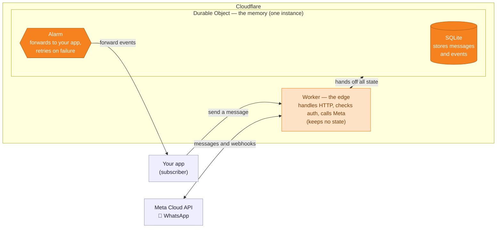

<div align="center">


<h3>Self-hostable, open-source WhatsApp gateway on the official Meta Cloud API</h3>

<p>Your app, your token, no message quota — running as a single Bun binary or <strong>entirely on Cloudflare</strong> (Workers + Durable Objects).</p>

[](https://github.com/santigamo/eccos/actions/workflows/ci.yml)
[](./LICENSE)
[](https://bun.sh)
[](https://workers.cloudflare.com)
[](https://www.typescriptlang.org)
[](./CONTRIBUTING.md)

</div>

---

Bring your own Meta app + WhatsApp Business Account. Eccos holds the credentials and gives your
apps a small, stable HTTP surface: **send messages**, **receive inbound + delivery statuses**,
and get **normalized events** forwarded to your backend.

> **Status: v0 / thin wrapper.** Single tenant (one WABA / one phone number). The Cloudflare
> Workers target adds an Embedded-Signup `/connect` flow and a read-only dashboard. Multi-tenant
> onboarding is on the [roadmap](#-roadmap).

## ✨ Why Eccos

- 🟢 **Official Cloud API** — built on Meta's WhatsApp Cloud API. No unofficial WhatsApp Web
  automation, so no fragile sessions and no ban risk.
- 🔓 **Self-host & own your token** — MIT-licensed, runs on your box. Eccos keeps your Meta
  credentials; your apps just talk to a small HTTP surface.
- 💸 **No message quota** — pay Meta directly. Service/inbound and in-window utility messages are
  free, and nobody meters or marks up your traffic.
- ⚡ **Two runtimes, one core** — the same pure core ships as a self-hostable **Bun** binary or
  on **Cloudflare Workers**.
- ☁️ **All-in on Cloudflare** — the Workers target runs the entire gateway on Cloudflare
  primitives: a **Worker** + one **Durable Object** (SQLite storage + Alarms for retries). No
  external database, queue or cron, and a permanent HTTPS webhook URL out of the box. Native
  Cloudflare Rate Limiting throttles the send API (`POST /v1/messages`) — no external infra.
- 🔁 **Reliable forwarding** — inbound messages and statuses are normalized and forwarded to your
  app, HMAC-signed and retried with exponential backoff.
- 🪪 **Onboarding + dashboard** — the Workers target ships an Embedded Signup `/connect` flow and
  a read-only ops `/dashboard`.

## 🆚 How it compares

| | **Eccos** | Managed Cloud-API SaaS | Unofficial<br>(Evolution API, WAHA, wuzapi) |
|---|:---:|:---:|:---:|
| WhatsApp API | ✅ Official Cloud API | ✅ Official Cloud API | ⚠️ Unofficial Web |
| Ban risk | ✅ None | ✅ None | ❌ High |
| Self-hosted | ✅ Yes | ❌ SaaS only | ✅ Yes |
| Open source | ✅ MIT | ❌ Closed | ✅ Varies |
| Message metering | ✅ Pay Meta direct | ❌ Metered / markup | — |
| Cost | ✅ Free | 💰 Paid | ✅ Free |

## 🧩 How it works

```
your app  ──POST /v1/messages──▶  Eccos  ──▶  Meta Cloud API  ──▶  WhatsApp
your app  ◀──forward (HMAC)────   Eccos  ◀──  Meta webhook    ◀──  WhatsApp
```

- **Outbound:** `POST /v1/messages` (Bearer `ECCOS_API_KEY`) → Meta `/{phone}/messages`.
- **Inbound:** Meta calls `POST /webhooks/meta`; Eccos verifies `X-Hub-Signature-256`,
  normalizes the payload, and forwards `{ events: [...] }` to your `SUBSCRIBER_WEBHOOK_URL`,
  signed `X-Eccos-Signature: sha256=<hex>` with `SUBSCRIBER_SECRET`. Failed forwards retry
  with exponential backoff.
- **Templates:** `GET /v1/templates` proxies the WABA's `message_templates`.

Normalized event shape (`WhatsAppCallbackEvent`):

```ts
| { type: "delivered" | "read"; transportMessageId; at }
| { type: "failed"; transportMessageId; at; errorCode?; errorMessage? }
| { type: "reply"; from; messageId; text; at }
| { type: "echo"; to; messageId; text; at }   // staff reply sent from the WhatsApp app (coexistence)
```

### Built entirely on Cloudflare

A WhatsApp gateway usually needs a server, a database, a job queue, a cron, and a public HTTPS
endpoint. The Workers target folds **all of it** into **two Cloudflare primitives**: a stateless
**Worker** at the edge, and a single **Durable Object** that owns its built-in **SQLite** and an
**Alarm**-driven retry loop. The Worker keeps no state — it hands every message and event to the
Durable Object. No external infrastructure at all.

In v0 this is intentionally one Durable Object instance (`idFromName("singleton")`) because Eccos
is still single-tenant. That keeps the first deployment small and auditable; the scale and
multi-tenant path is one Durable Object per WABA/phone, which is already on the roadmap.



_Orange = the stateful Durable Object primitives (SQLite + Alarm); peach = the stateless Worker._

| Cloudflare primitive | What it does in Eccos | Replaces |
|---|---|---|
| **Worker** (`apps/gateway/src/worker.ts`) | Stateless edge HTTP — auth, calls the Meta API, hands all state to the Durable Object | a web server |
| **Durable Object** — `EccosGateway` (`apps/gateway/src/gateway.ts`) | One global, single-writer instance that owns all state and coordination | a stateful service + locking |
| **DO SQLite storage** | Inbound events, outbound log, the delivery queue, onboarding config | a database |
| **DO Alarms** | Wakes the DO to forward events and retry with exponential backoff | a job queue + cron |
| **Rate Limiting binding** | Native throttling on `POST /v1/messages` (defensive; no-op if unbound) | an external rate limiter |
| **`workers.dev` + TLS** | A permanent HTTPS URL for Meta's webhook — no tunnel, no domain setup | a domain, TLS & reverse proxy |
| **Workers Observability** | Request logs at 100 % head-sampling | a logging/metrics stack |

## 🎯 Deployment targets

Eccos ships **two targets that share one pure core** (`packages/core/`: parser, signature, send,
templates). Pick whichever fits how you want to run it:

| | **Bun** (self-host) | **Cloudflare Workers** |
|---|---|---|
| Code | `src/` | `apps/gateway/` |
| Storage | SQLite (`bun:sqlite`) | Durable Object (SQLite) |
| Forwarding retries | in-process loop | Durable Object Alarms |
| Deploy | Docker / single process | `wrangler deploy` |
| Embedded Signup `/connect` | — | ✅ |
| Read-only `/dashboard` | — | ✅ |
| Best for | owning the box and the token | zero-ops + a stable HTTPS webhook URL |

The Bun target is the auditable, run-it-anywhere binary. The Workers target trades literal
"your box" for zero-ops and a permanent HTTPS URL (no tunnel needed for Meta webhooks), and
is where the newer v1 features (connect, dashboard) live first.

## 🚀 Quickstart — local (Bun)

```bash
bun install
cp .env.example .env   # fill in META_* + ECCOS_API_KEY + SUBSCRIBER_*
bun run dev            # http://localhost:3000/health
```

To receive webhooks during development, expose the port (e.g. `ngrok http 3000` or
`cloudflared tunnel --url http://localhost:3000`) and set the Meta webhook callback URL to
`https://<public-host>/webhooks/meta` with your `META_WEBHOOK_VERIFY_TOKEN`. Subscribe the
**`messages`** field.

## 🐳 Quickstart — self-host (Docker)

```bash
cp .env.example .env   # fill in values
docker compose up -d
```

SQLite data is persisted in the `eccos-data` volume. The bundled `.dockerignore` keeps your
`.env` and local data out of the image.

## ☁️ Quickstart — Cloudflare Workers

```bash
bun install
bun run cf-types                 # generate worker-configuration.d.ts
# Required secrets:
wrangler secret put META_ACCESS_TOKEN
wrangler secret put META_PHONE_NUMBER_ID
wrangler secret put META_WABA_ID
wrangler secret put META_APP_SECRET
wrangler secret put META_WEBHOOK_VERIFY_TOKEN
wrangler secret put ECCOS_API_KEY
# Optional (event forwarding):
wrangler secret put SUBSCRIBER_SECRET
wrangler secret put SUBSCRIBER_WEBHOOK_URL
# Optional (Embedded Signup /connect flow):
wrangler secret put META_APP_ID
wrangler secret put META_ES_CONFIG_ID

bun run deploy                   # wrangler deploy
```

Non-secret vars (`META_GRAPH_VERSION`, `FORWARD_MAX_ATTEMPTS`) live in `wrangler.jsonc`.
Point Meta's webhook at `https://<worker>.workers.dev/webhooks/meta`. All six required
secrets must be set for the Worker to boot; the `/connect` (Embedded Signup) flow then
updates the effective `META_WABA_ID` / `META_PHONE_NUMBER_ID` at runtime in the Durable
Object.

## 📡 HTTP API

| Method | Path              | Auth                   | Target | Purpose                              |
|--------|-------------------|------------------------|--------|--------------------------------------|
| GET    | `/health`         | none                   | both   | Liveness                             |
| GET    | `/webhooks/meta`  | verify token (query)   | both   | Meta subscription challenge          |
| POST   | `/webhooks/meta`  | `X-Hub-Signature-256`  | both   | Inbound messages + delivery statuses |
| POST   | `/v1/messages`    | Bearer `ECCOS_API_KEY` | both   | Send a message                       |
| GET    | `/v1/templates`   | Bearer `ECCOS_API_KEY` | both   | List message templates              |
| GET    | `/connect`        | Meta OAuth             | Workers| Embedded Signup (coexistence) flow  |
| POST   | `/connect/exchange` | Meta OAuth code      | Workers| Exchange OAuth code → store WABA/phone |
| GET    | `/dashboard`      | basic auth (`eccos` / `ECCOS_API_KEY`) | Workers | Read-only ops dashboard |

### Send example

```bash
curl -X POST http://localhost:3000/v1/messages \
  -H "authorization: Bearer $ECCOS_API_KEY" \
  -H "content-type: application/json" \
  -d '{
    "to": "34600000000",
    "type": "template",
    "template": {
      "name": "pre_cita",
      "language": { "code": "es" },
      "components": [
        { "type": "body", "parameters": [
          { "type": "text", "parameter_name": "customer_name", "text": "Ana" }
        ] }
      ]
    }
  }'
```

The body is a Meta message object minus `messaging_product` (Eccos injects it). Returns
`{ "ok": true, "messages": [{ "id": "wamid..." }] }`.

## ⚙️ Configuration

See [`.env.example`](./.env.example). Required: `META_ACCESS_TOKEN`, `META_PHONE_NUMBER_ID`,
`META_WABA_ID`, `META_APP_SECRET`, `META_WEBHOOK_VERIFY_TOKEN`, `ECCOS_API_KEY`. Forwarding
(`SUBSCRIBER_WEBHOOK_URL` / `SUBSCRIBER_SECRET`) is optional — without it, inbound events are
still stored, just not pushed. On the Workers target the same names are set with
`wrangler secret`; the Embedded Signup flow additionally uses `META_APP_ID` and
`META_ES_CONFIG_ID`.

## 🛠️ Development

```bash
bun run typecheck      # tsc --noEmit
bun run test           # Bun unit tests (parser, signature, connect, config)
bun run test:workers   # vitest-pool-workers integration tests for the Workers target
```

See [CONTRIBUTING.md](./CONTRIBUTING.md) for the repository layout and conventions, and
[docs/BRAND.md](./docs/BRAND.md) for the visual identity if you're making assets.

## 🗺️ Roadmap

- [x] Embedded Signup `/connect` (single-tenant coexistence) — Workers target
- [x] Read-only admin dashboard — Workers target
- [ ] Bun-target parity for `/connect` + `/dashboard`
- [ ] Multi-tenant: multiple WABAs/numbers per instance
- [ ] Shard Workers state: one Durable Object per WABA/phone
- [ ] Self-serve onboarding for Tech Providers (connect *clients'* numbers)
- [ ] Serverless storage path: per-tenant DO SQLite → D1 for cross-tenant SQL (10 GB cap) → Hyperdrive to external Postgres/MySQL only if required
- [x] Cloudflare Rate Limiting on the send API (`POST /v1/messages`)
- [ ] Cloudflare Queues + dead-letter queue for outbound forwarding
- [ ] R2 for outbound media
- [ ] Outbound media + interactive message helpers

## 🤝 Contributing

Issues and PRs welcome — see [CONTRIBUTING.md](./CONTRIBUTING.md). For security reports, see
[SECURITY.md](./SECURITY.md). Brand and asset guidelines live in [docs/BRAND.md](./docs/BRAND.md).

## 📄 License

MIT © Santiago García Monsalve
