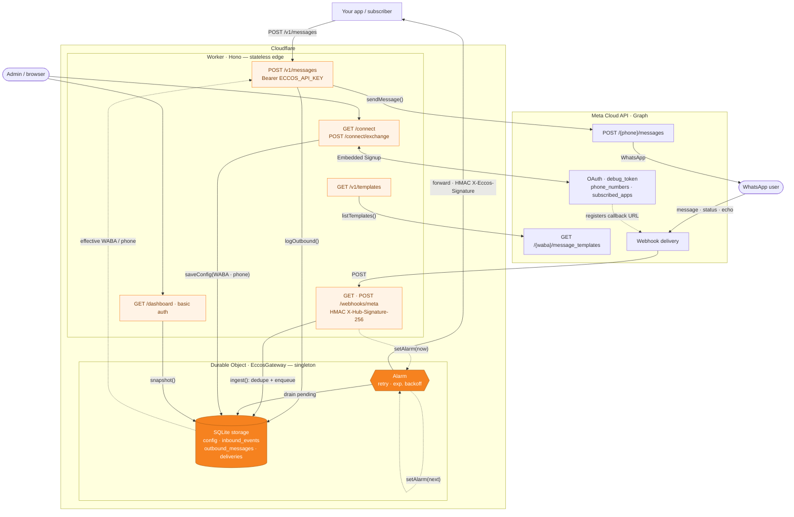

# Eccos

[](https://github.com/santigamo/eccos/actions/workflows/ci.yml)
[](./LICENSE)

**Self-hostable, open-source WhatsApp gateway on the official Meta Cloud API.**
A [Kapso](https://kapso.ai) alternative you can run yourself — no unofficial WhatsApp Web
automation, no platform message quota. You bring your own Meta app + WhatsApp Business
Account; Eccos holds the credentials and gives your apps a small, stable HTTP surface.

> Status: **v0 / thin wrapper.** Single tenant (one WABA / one phone number). Sends
> messages, receives inbound + delivery statuses, and forwards normalized events to your
> app. A Cloudflare Workers target adds an Embedded-Signup `/connect` flow and a read-only
> dashboard. Multi-tenant onboarding is on the roadmap.

## Why

- Most OSS WhatsApp tools (Evolution API, WAHA, wuzapi, …) drive **unofficial WhatsApp
  Web** → fragile and ban-prone. Official Cloud API options (Kapso, 360dialog, …) are
  paid/closed and meter your messages.
- Eccos is **OSS + official Cloud API + self-host**: run it on your own box, pay Meta
  directly (service/inbound and in-window utility messages are free), keep full control.

## Architecture

```
your app  ──POST /v1/messages──▶  Eccos  ──▶  Meta Cloud API  ──▶  WhatsApp
your app  ◀──forward (HMAC)────   Eccos  ◀──  Meta webhook    ◀──  WhatsApp
```

- **Outbound:** `POST /v1/messages` (Bearer `ECCOS_API_KEY`) → Meta `/{phone}/messages`.
- **Inbound:** Meta calls `POST /webhooks/meta`; Eccos verifies `X-Hub-Signature-256`,
  normalizes the payload, and forwards `{ events: [...] }` to your `SUBSCRIBER_WEBHOOK_URL`,
  signed `X-Eccos-Signature: sha256=<hex>` with `SUBSCRIBER_SECRET`. Failed forwards retry
  with exponential backoff.
- **Templates:** `GET /v1/templates` proxies the WABA's `message_templates`.

Normalized event shape (`WhatsAppCallbackEvent`):

```ts
| { type: "delivered" | "read"; transportMessageId; at }
| { type: "failed"; transportMessageId; at; errorCode?; errorMessage? }
| { type: "reply"; from; messageId; text; at }
| { type: "echo"; to; messageId; text; at }   // staff reply sent from the WhatsApp app (coexistence)
```

### Cloudflare Workers topology

The Workers target maps the gateway onto four Cloudflare primitives: a stateless **Worker**
(the Hono router) sits at the edge and delegates all state to a single **Durable Object**,
which owns its embedded **SQLite storage** and an **Alarm**-driven retry loop. The Worker
terminates HTTP and talks to Meta; the Durable Object is the single source of truth and does
the durable, retried event forwarding.



**Cloudflare primitives** (orange = stateful DO primitives, peach = Worker routes)

- **Worker** — `worker/worker.ts`. Stateless Hono app at the edge: terminates HTTP, checks
  `Bearer` / HMAC auth, calls the Meta Graph API, and forwards every stateful operation to the
  Durable Object through its stub. Holds no data between requests.
- **Durable Object · `EccosGateway`** — `worker/gateway.ts`, bound as `ECCOS` (migration `v1`).
  One global singleton (`idFromName("singleton")`) that serializes writes and is the source of
  truth for the onboarded `META_WABA_ID` / `META_PHONE_NUMBER_ID` (overlaid over env on every
  send and templates call).
- **DO SQLite storage** — `ctx.storage.sql`. Four tables (`config`, `inbound_events`,
  `outbound_messages`, `deliveries`) created once under `blockConcurrencyWhile`; inbound dedupe
  via unique indexes, atomic writes via `transactionSync`.
- **DO Alarms** — `ctx.storage.setAlarm()` + `alarm()`. The forwarding engine: drains pending
  deliveries in batches of 40, signs + POSTs them to `SUBSCRIBER_WEBHOOK_URL`, retries with
  exponential backoff up to `FORWARD_MAX_ATTEMPTS`, prunes rows past the 30-day retention, then
  self-reschedules to the next due delivery.
- **Observability & routing** — `wrangler.jsonc`: Workers logs at 100% head-sampling, and
  `workers_dev: true` exposes the `*.workers.dev` URL that Meta points its webhook at.

## Deployment targets

Eccos ships **two targets that share one pure core** (`src/core/`: parser, signature, send,
templates). Pick whichever fits how you want to run it:

| | **Bun** (self-host) | **Cloudflare Workers** |
|---|---|---|
| Code | `src/` | `worker/` |
| Storage | SQLite (`bun:sqlite`) | Durable Object (SQLite) |
| Forwarding retries | in-process loop | Durable Object Alarms |
| Deploy | Docker / single process | `wrangler deploy` |
| Embedded Signup `/connect` | — | ✅ |
| Read-only `/dashboard` | — | ✅ |
| Best for | owning the box and the token | zero-ops + a stable HTTPS webhook URL |

The Bun target is the auditable, run-it-anywhere binary. The Workers target trades literal
"your box" for zero-ops and a permanent HTTPS URL (no tunnel needed for Meta webhooks), and
is where the newer v1 features (connect, dashboard) live first.

## Quickstart (local, Bun)

```bash
bun install
cp .env.example .env   # fill in META_* + ECCOS_API_KEY + SUBSCRIBER_*
bun run dev            # http://localhost:3000/health
```

To receive webhooks during development, expose the port (e.g. `ngrok http 3000` or
`cloudflared tunnel --url http://localhost:3000`) and set the Meta webhook callback URL to
`https://<public-host>/webhooks/meta` with your `META_WEBHOOK_VERIFY_TOKEN`. Subscribe the
**`messages`** field.

## Quickstart (self-host, Docker)

```bash
cp .env.example .env   # fill in values
docker compose up -d
```

SQLite data is persisted in the `eccos-data` volume. The bundled `.dockerignore` keeps your
`.env` and local data out of the image.

## Quickstart (Cloudflare Workers)

```bash
bun install
bun run cf-types                 # generate worker-configuration.d.ts
# Required secrets:
wrangler secret put META_ACCESS_TOKEN
wrangler secret put META_PHONE_NUMBER_ID
wrangler secret put META_WABA_ID
wrangler secret put META_APP_SECRET
wrangler secret put META_WEBHOOK_VERIFY_TOKEN
wrangler secret put ECCOS_API_KEY
# Optional (event forwarding):
wrangler secret put SUBSCRIBER_SECRET
wrangler secret put SUBSCRIBER_WEBHOOK_URL
# Optional (Embedded Signup /connect flow):
wrangler secret put META_APP_ID
wrangler secret put META_ES_CONFIG_ID

bun run deploy                   # wrangler deploy
```

Non-secret vars (`META_GRAPH_VERSION`, `FORWARD_MAX_ATTEMPTS`) live in `wrangler.jsonc`.
Point Meta's webhook at `https://<worker>.workers.dev/webhooks/meta`. All six required
secrets must be set for the Worker to boot; the `/connect` (Embedded Signup) flow then
updates the effective `META_WABA_ID` / `META_PHONE_NUMBER_ID` at runtime in the Durable
Object.

## HTTP API

| Method | Path              | Auth                   | Target | Purpose                              |
|--------|-------------------|------------------------|--------|--------------------------------------|
| GET    | `/health`         | none                   | both   | Liveness                             |
| GET    | `/webhooks/meta`  | verify token (query)   | both   | Meta subscription challenge          |
| POST   | `/webhooks/meta`  | `X-Hub-Signature-256`  | both   | Inbound messages + delivery statuses |
| POST   | `/v1/messages`    | Bearer `ECCOS_API_KEY` | both   | Send a message                       |
| GET    | `/v1/templates`   | Bearer `ECCOS_API_KEY` | both   | List message templates              |
| GET    | `/connect`        | Meta OAuth             | Workers| Embedded Signup (coexistence) flow  |
| POST   | `/connect/exchange` | Meta OAuth code      | Workers| Exchange OAuth code → store WABA/phone |
| GET    | `/dashboard`      | basic auth (`eccos` / `ECCOS_API_KEY`) | Workers | Read-only ops dashboard |

### Send example

```bash
curl -X POST http://localhost:3000/v1/messages \
  -H "authorization: Bearer $ECCOS_API_KEY" \
  -H "content-type: application/json" \
  -d '{
    "to": "34600000000",
    "type": "template",
    "template": {
      "name": "pre_cita",
      "language": { "code": "es" },
      "components": [
        { "type": "body", "parameters": [
          { "type": "text", "parameter_name": "customer_name", "text": "Ana" }
        ] }
      ]
    }
  }'
```

The body is a Meta message object minus `messaging_product` (Eccos injects it). Returns
`{ "ok": true, "messages": [{ "id": "wamid..." }] }`.

## Configuration

See [`.env.example`](./.env.example). Required: `META_ACCESS_TOKEN`, `META_PHONE_NUMBER_ID`,
`META_WABA_ID`, `META_APP_SECRET`, `META_WEBHOOK_VERIFY_TOKEN`, `ECCOS_API_KEY`. Forwarding
(`SUBSCRIBER_WEBHOOK_URL` / `SUBSCRIBER_SECRET`) is optional — without it, inbound events are
still stored, just not pushed. On the Workers target the same names are set with
`wrangler secret`; the Embedded Signup flow additionally uses `META_APP_ID` and
`META_ES_CONFIG_ID`.

## Development

```bash
bun run typecheck      # tsc --noEmit
bun run test           # Bun unit tests (parser, signature, connect, config)
bun run test:workers   # vitest-pool-workers integration tests for the Workers target
```

See [CONTRIBUTING.md](./CONTRIBUTING.md) for the repository layout and conventions.

## Roadmap

- [x] Embedded Signup `/connect` (single-tenant coexistence) — Workers target
- [x] Read-only admin dashboard — Workers target
- [ ] Bun-target parity for `/connect` + `/dashboard`
- [ ] Multi-tenant: multiple WABAs/numbers per instance
- [ ] Self-serve onboarding for Tech Providers (connect *clients'* numbers)
- [ ] Postgres storage option (Drizzle)
- [ ] Outbound media + interactive message helpers

## Contributing

Issues and PRs welcome — see [CONTRIBUTING.md](./CONTRIBUTING.md). For security reports, see
[SECURITY.md](./SECURITY.md).

## License

MIT © Santiago García Monsalve
