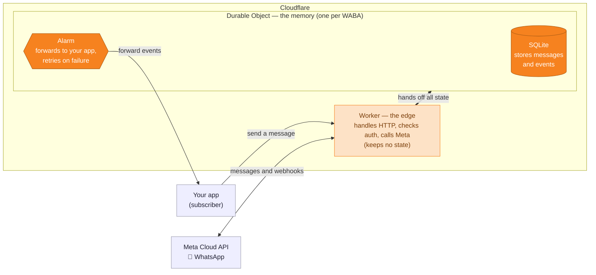

<div align="center">


<h3>Self-hostable, open-source WhatsApp gateway on the official Meta Cloud API</h3>

<p>Your app, your token, no message quota — running as a single Bun binary or <strong>entirely on Cloudflare</strong> (Workers + Durable Objects).</p>

<p><a href="https://eccos.chat"><strong>eccos.chat</strong></a> · <a href="https://eccos.chat/">Español</a> · <a href="https://eccos.chat/en">English</a></p>

[](https://github.com/santigamo/eccos/actions/workflows/ci.yml)
[](./LICENSE)
[](https://bun.sh)
[](https://workers.cloudflare.com)
[](https://www.typescriptlang.org)
[](./CONTRIBUTING.md)

<br />

[](https://deploy.workers.cloudflare.com/?url=https://github.com/santigamo/eccos/tree/main/apps/gateway)

</div>

---

Bring your own Meta app + WhatsApp Business Account. Eccos holds the credentials and gives your
apps a small, stable HTTP surface: **send messages**, **receive inbound + delivery statuses**,
and get **normalized events** forwarded to your backend.

> **Status: v0 / first customer wave.** The Workers target is **account-scoped by default**: a
> durable account → WABA → phone registry, hashed account keys, per-WABA credentials, and
> account-bound Embedded Signup. Each WABA routes to its own Durable Object for data-plane
> sharding. **Eccos Cloud remains early access**: we do not charge third parties (nor start paid
> third-party trials) until the complete isolation, Meta, legal, Access, and operations gate in
> [PRODUCTION-READINESS.md](./PRODUCTION-READINESS.md) is clear.

## ✨ Why Eccos

- 🟢 **Official Cloud API** — built on Meta's WhatsApp Cloud API. No unofficial WhatsApp Web
  automation, so no fragile sessions and no ban risk.
- 🔓 **Self-host & own your token** — MIT-licensed, runs on your box. Eccos keeps your Meta
  credentials; your apps just talk to a small HTTP surface.
- 💸 **No message quota** — pay Meta directly. Service/inbound and in-window utility messages are
  free, and nobody meters or marks up your traffic.
- ⚡ **Two runtimes, one core** — the same pure core ships as a self-hostable **Bun** binary or
  on **Cloudflare Workers**.
- ☁️ **All-in on Cloudflare** — the Workers target runs the entire gateway on Cloudflare
  primitives: a **Worker** + one **Durable Object per WABA** (SQLite storage + Alarms for retries)
  and a native cron trigger for provisioning reconciliation. No external database or queue, and a
  permanent HTTPS webhook URL out of the box. Native Cloudflare Rate Limiting throttles the scoped
  send API — no external infra.
- 🔁 **Reliable forwarding** — inbound messages and statuses are normalized and forwarded to your
  app, HMAC-signed and retried with exponential backoff.
- 🪪 **Onboarding + operator console** — the Workers target ships an Embedded Signup `/connect`
  flow, plus a separate operator console Worker (`apps/dashboard/`) for ops visibility — status,
  inbound/outbound/deliveries, the subscriber target and resubscribe — reachable only over a
  private RPC binding and gated by Cloudflare Access. Per-number GDPR erasure is available through
  the scoped HTTP/RPC API.

## 🆚 How it compares

| | **Eccos** | Managed Cloud-API SaaS | Unofficial<br>(Evolution API, WAHA, wuzapi) |
|---|:---:|:---:|:---:|
| WhatsApp API | ✅ Official Cloud API | ✅ Official Cloud API | ⚠️ Unofficial Web |
| Ban risk | ✅ None | ✅ None | ❌ High |
| Self-hosted | ✅ Yes | ❌ SaaS only | ✅ Yes |
| Open source | ✅ MIT | ❌ Closed | ✅ Varies |
| Message metering | ✅ Pay Meta direct | ❌ Metered / markup | — |
| Cost | ✅ Free | 💰 Paid | ✅ Free |

## 🧩 How it works

```
     your app  ──POST /v1/wabas/<WABA_ID>/messages──▶  Eccos  ──▶  Meta Cloud API  ──▶  WhatsApp
your app  ◀──forward (HMAC)────   Eccos  ◀──  Meta webhook    ◀──  WhatsApp
```

- **Outbound:** Workers use `POST /v1/wabas/<WABA_ID>/messages` with an account API key → Meta `/{phone}/messages`.
- **Inbound:** Meta calls `POST /webhooks/meta`; Eccos verifies `X-Hub-Signature-256`,
  normalizes the payload, and forwards `{ events: [...] }` to the subscriber URL configured for
  that WABA, signed `X-Eccos-Signature: sha256=<hex>` when a subscriber secret is configured.
  Failed forwards retry with exponential backoff.
- **Templates:** Workers use `GET /v1/wabas/<WABA_ID>/templates` to proxy the WABA's `message_templates`.

Normalized event shape (`WhatsAppCallbackEvent`):

```ts
| { type: "delivered" | "read"; transportMessageId; at }
| { type: "failed"; transportMessageId; at; errorCode?; errorMessage? }
| { type: "reply"; from; messageId; text; at }
| { type: "echo"; to; messageId; text; at }   // staff reply sent from the WhatsApp app (coexistence)
```

### Built entirely on Cloudflare

A WhatsApp gateway usually needs a server, a database, a job queue, a cron, and a public HTTPS
endpoint. The Workers target folds **all of it** into **two Cloudflare primitives**: a stateless
**Worker** at the edge, and one or more **Durable Objects** that own built-in **SQLite** and
**Alarm**-driven retry loops. Each WABA routes to its own versioned object. The Worker keeps no
state — it hands every message and event to the appropriate object. No external infrastructure at
all.

The object name is versioned with the WABA and jurisdiction frozen into the routing key; see [the
deployment runbook](./docs/deployment.md) before deploying.


```mermaid
flowchart LR
    meta["Meta Cloud API<br/>📱 WhatsApp"]
    app["Your app<br/>(subscriber)"]

    subgraph cf["Cloudflare"]
        direction TB
        worker["Worker — the edge<br/>handles HTTP, checks auth, calls Meta<br/>(keeps no state)"]
        subgraph dobj["Durable Object — the memory (one per WABA)"]
            direction LR
            sqlite[("SQLite<br/>stores messages<br/>and events")]
            alarm{{"Alarm<br/>forwards to your app,<br/>retries on failure"}}
        end
        worker ==>|"hands off all state"| dobj
    end

    app -->|"send a message"| worker
    meta <-->|"messages and webhooks"| worker
    alarm -->|"forward events"| app

    classDef ext fill:#eef,stroke:#99a,color:#223;
    classDef edge2 fill:#fde2c6,stroke:#f6821f,color:#7a3e0a;
    classDef stateful fill:#f6821f,stroke:#a85a12,color:#fff;
    class meta,app ext;
    class worker edge2;
    class sqlite,alarm stateful;
```

_Orange = the stateful Durable Object primitives (SQLite + Alarm); peach = the stateless Worker._

| Cloudflare primitive | What it does in Eccos | Replaces |
|---|---|---|
| **Worker** (`apps/gateway/src/worker.ts`) | Stateless edge HTTP — auth, calls the Meta API, hands all state to the Durable Object | a web server |
| **Durable Object** — `EccosGateway` (`apps/gateway/src/gateway.ts`) | One versioned, single-writer instance per WABA | a stateful service + locking |
| **DO SQLite storage** | Inbound events, outbound log, the delivery queue, onboarding config | a database |
| **DO Alarms** | Wakes the DO to forward events and retry with exponential backoff | a job queue + cron |
| **Rate Limiting binding** | Native throttling on `POST /v1/messages` (defensive; no-op if unbound) | an external rate limiter |
| **`workers.dev` + TLS** | A permanent HTTPS URL for Meta's webhook — no tunnel, no domain setup | a domain, TLS & reverse proxy |
| **Workers Observability** | Request logs at 100 % head-sampling | a logging/metrics stack |

## 🎯 Deployment targets

Eccos ships **two targets that share one pure core** (`packages/core/`: parser, signature, send,
templates). Pick whichever fits how you want to run it:

| | **Bun** (self-host) | **Cloudflare Workers** |
|---|---|---|
| Code | `src/` | `apps/gateway/` |
| Storage | SQLite (`bun:sqlite`) | Durable Object (SQLite) |
| Forwarding retries | in-process loop | Durable Object Alarms |
| Deploy | Docker / single process | `wrangler deploy` |
| Embedded Signup `/connect` | — | ✅ |
| Best for | owning the box and the token | zero-ops + a stable HTTPS webhook URL |

The Bun target is the auditable, run-it-anywhere binary. The Workers target trades literal
"your box" for zero-ops and a permanent HTTPS URL (no tunnel needed for Meta webhooks), and
is where the newer v1 features (`/connect`, plus the operator console below) live first.

### 🕹️ Operator console

The operator console lives in [`apps/dashboard/`](./apps/dashboard/) as its **own** Cloudflare
Worker (a TanStack Start / React app) — it is **not** a route on the gateway. It reaches the
gateway only over a private **RPC service binding** (`env.GATEWAY`, entrypoint `GatewayRPC`); the
gateway itself exposes **no public dashboard HTTP surface**. The console is secured with
[Cloudflare Access](https://developers.cloudflare.com/cloudflare-one/policies/access/) (the
Worker also re-verifies the Access JWT itself, as defense-in-depth). See
[`apps/dashboard/README.md`](./apps/dashboard/README.md) for setup.

## 🚀 Quickstart — local (Bun)

```bash
bun install
cp .env.example .env   # fill in META_* + ECCOS_API_KEY + SUBSCRIBER_*
bun run dev            # http://localhost:3000/health
```

To receive webhooks during development, expose the port (e.g. `ngrok http 3000` or
`cloudflared tunnel --url http://localhost:3000`) and set the Meta webhook callback URL to
`https://<public-host>/webhooks/meta` with your `META_WEBHOOK_VERIFY_TOKEN`. Subscribe the
**`messages`** field.

## 🐳 Quickstart — self-host (Docker)

```bash
cp .env.example .env   # fill in values
docker compose up -d
```

SQLite data is persisted in the `eccos-data` volume. The bundled `.dockerignore` keeps your
`.env` and local data out of the image.

## ☁️ Quickstart — Cloudflare Workers

```bash
bun install
bun run cf-types                 # generate worker-configuration.d.ts
# Required app-level secrets:
wrangler secret put META_APP_SECRET
wrangler secret put META_WEBHOOK_VERIFY_TOKEN
wrangler secret put ECCOS_ADMIN_API_KEY
# Optional (Embedded Signup /connect flow):
wrangler secret put META_APP_ID
wrangler secret put META_ES_CONFIG_ID

bun run deploy                   # wrangler deploy
```

The Workers target is **account-scoped by default** — there are no global `META_ACCESS_TOKEN` /
`META_WABA_ID` / `META_PHONE_NUMBER_ID` / `ECCOS_API_KEY` / `SUBSCRIBER_*` secrets. Per-WABA Meta
credentials and subscriber settings live in the control plane / per-WABA Durable Object runtime
state: create an account, then register WABAs through the Embedded Signup `/connect` flow or the
admin bootstrap API (see [docs/multi-tenancy.md](docs/multi-tenancy.md)).

### One-click deploy

[](https://deploy.workers.cloudflare.com/?url=https://github.com/santigamo/eccos/tree/main/apps/gateway)

The button deploys the **gateway Worker** (`apps/gateway/`); the operator console
(`apps/dashboard/`) is a separate Worker you deploy on its own. Two things to know about the
guided flow:

- **Monorepo:** Eccos is a Bun workspace and the gateway imports `@eccos/core` /
  `@eccos/gateway-contract` via `workspace:*`. If Cloudflare's build can't resolve them, point the
  build's install/root at the **repo root** (run `bun install` at the root, deploy `apps/gateway`).
- **Secrets:** the button provisions bindings but not secret values — set the app-level secrets
  (listed above) with `wrangler secret put` or in the dashboard after the first deploy.

Every deployment is account-scoped by default — one-account and multi-account installs follow the
same flow. Create accounts and register WABAs through the
[multi-tenant deployment runbook](docs/multi-tenancy.md).

The `bun install → wrangler secret put → bun run deploy` steps above are the reliable path; see
[`docs/deployment.md`](./docs/deployment.md) for the full env matrix, smoke test, and rollback.

Non-secret vars (`META_GRAPH_VERSION`, `FORWARD_MAX_ATTEMPTS`, `CONTENT_RETENTION_DAYS`,
`DELIVERY_RETENTION_DAYS`, and optionally `DO_JURISDICTION`) live in
`wrangler.jsonc`.
Point Meta's webhook at `https://<worker>.workers.dev/webhooks/meta` — or, once you put the Worker
on a custom domain under your Meta app's declared application domain, at
`https://<your-gateway-host>/webhooks/meta`; the ordered cutover between the two is in
[`docs/deployment.md`](./docs/deployment.md#cutover--moving-the-meta-facing-origin-to-a-custom-domain).
An empty account registry is
a healthy gateway: `/ready` reports the app-level Meta secrets (never values) plus the control
plane's liveness, and webhooks/sends become reachable once an account owns a registered WABA.

> **Data residency:** to pin the Durable Object to a Cloudflare jurisdiction (e.g. `"eu"`),
> set `DO_JURISDICTION` **on the first deploy, before any production data exists**. Changing
> it later derives a different `DurableObjectId` — a new, **empty** Durable Object — and does
> **not** migrate the existing data (messages, delivery queue, connected WABA/phone config).
> Details in [docs/deployment.md](./docs/deployment.md).

> **Moving from Eccos Cloud to a self-host?** The migration guide lives at
> [eccos.chat/migrate](https://eccos.chat/migrate) (source: `apps/site/src/page-content/migrate.html`).
> Short version: there is no automatic export — you page through the operator RPC reads for what
> is still within retention, redeploy with your own Meta credentials, re-point the webhook and
> subscriber, smoke-test, and only then decommission Cloud. Meta tokens, operator secrets, the
> `DurableObjectId`/Alarm, and the Embedded Signup OAuth connection are not portable.

## 📡 HTTP API

| Method | Path              | Auth                   | Target | Purpose                              |
|--------|-------------------|------------------------|--------|--------------------------------------|
| GET    | `/health`         | none                   | both   | Liveness                             |
| GET    | `/webhooks/meta`  | verify token (query)   | both   | Meta subscription challenge          |
| POST   | `/webhooks/meta`  | `X-Hub-Signature-256`  | both   | Inbound messages + delivery statuses |
| POST   | `/v1/messages`    | Bearer `ECCOS_API_KEY` | Bun    | Send a message                       |
| POST   | `/v1/wabas/<id>/messages` | Bearer account key | Workers | Send through a WABA the account owns |
| GET    | `/v1/templates`   | Bearer `ECCOS_API_KEY` | Bun    | List message templates              |
| GET    | `/v1/wabas/<id>/templates` | Bearer account key | Workers | List templates for an owned WABA |
| POST   | `/v1/wabas/<id>/privacy/erasure` | Bearer account key | Workers | Erase within an owned WABA |
| GET    | `/v1/wabas/<id>/export` | Bearer account key | Workers | Export an owned WABA's retained data |
| GET    | `/connect`        | account key / Meta OAuth | Workers| Embedded Signup (coexistence) flow  |
| POST   | `/connect/exchange` | account key + OAuth state | Workers| Exchange OAuth code → register WABA/phone |

The gateway has no public dashboard route — the operator console is a separate Worker; see
[Operator console](#-operator-console) above.

### Send example

```bash
curl -X POST http://localhost:3000/v1/messages \
  -H "authorization: Bearer $ECCOS_API_KEY" \
  -H "content-type: application/json" \
  -d '{
    "to": "34600000000",
    "type": "template",
    "template": {
      "name": "pre_cita",
      "language": { "code": "es" },
      "components": [
        { "type": "body", "parameters": [
          { "type": "text", "parameter_name": "customer_name", "text": "Ana" }
        ] }
      ]
    }
  }'
```

The body is a Meta message object minus `messaging_product` (Eccos injects it). Returns
`{ "ok": true, "messages": [{ "id": "wamid..." }] }`.

## ⚙️ Configuration

See [`.env.example`](./.env.example) — that file documents the **Bun** self-host target, which
remains single-tenant (`META_ACCESS_TOKEN`, `META_PHONE_NUMBER_ID`, `META_WABA_ID`,
`META_APP_SECRET`, `META_WEBHOOK_VERIFY_TOKEN`, `ECCOS_API_KEY`; forwarding via
`SUBSCRIBER_WEBHOOK_URL` / `SUBSCRIBER_SECRET` is optional — without it, inbound events are still
stored, just not pushed).

The **Workers target is account-scoped by default**: on Workers, per-WABA Meta credentials and
account keys live in the control plane instead; configure only `META_APP_SECRET`,
`META_WEBHOOK_VERIFY_TOKEN`, and the admin bootstrap `ECCOS_ADMIN_API_KEY`, then follow
[`docs/multi-tenancy.md`](./docs/multi-tenancy.md). The Embedded Signup flow additionally uses
`META_APP_ID`, `META_ES_CONFIG_ID`, and (for the dashboard button) the gateway's public
`GATEWAY_PUBLIC_URL`.

## 🛠️ Development

```bash
bun run typecheck      # tsc --noEmit
bun run test           # Bun unit tests (parser, signature, connect, config)
bun run test:workers   # vitest-pool-workers integration tests for the Workers target
bun run check:site     # Astro check, static build, and generated-site link check
bun run dev:site       # Astro development server for apps/site
```

See [CONTRIBUTING.md](./CONTRIBUTING.md) for the repository layout and conventions. If you're
making assets or touching [eccos.chat](https://eccos.chat) (`apps/site/`), the visual identity
lives in [docs/BRAND.md](./docs/BRAND.md) and the site's design rules — tokens, the two laws,
motion, and the legal invariants — in [docs/DESIGN-SYSTEM.md](./docs/DESIGN-SYSTEM.md).

## 🗺️ Roadmap

- [x] Embedded Signup `/connect` (account-bound coexistence) — Workers target
- [x] Operator console (`apps/dashboard/`) — separate Worker, RPC-only, Cloudflare Access
- [ ] Bun-target parity for `/connect` (and an operator-console equivalent)
- [ ] Workers account-scoped onboarding and isolation for multiple WABAs and phones — the
      registry/auth/connect foundation and local provisioning reconciliation are landed, but
      production-shaped two-number acceptance and release evidence remain. **Commercial
      prerequisite:** Eccos Cloud must not charge third parties (or start paid trials) before the
      complete isolation gate (`eccos-v80`) and its external dependencies are clear; see
      [PRODUCTION-READINESS.md](./PRODUCTION-READINESS.md)
- [x] Shard Workers state: one Durable Object per WABA with jurisdiction in the routing key
      (data-plane sharding; not paid multi-tenancy)
- [x] Account-key browser handoff for Tech Provider onboarding (connect *clients'* numbers)
- [ ] Serverless storage path: per-tenant DO SQLite → D1 for cross-tenant SQL (10 GB cap) → Hyperdrive to external Postgres/MySQL only if required
- [x] Cloudflare Rate Limiting on the scoped Workers send API
- [ ] Cloudflare Queues + dead-letter queue for outbound forwarding
- [ ] R2 for outbound media
- [ ] Outbound media + interactive message helpers

## 🤝 Contributing

Issues and PRs welcome — see [CONTRIBUTING.md](./CONTRIBUTING.md). For security reports, see
[SECURITY.md](./SECURITY.md). Brand and asset guidelines live in [docs/BRAND.md](./docs/BRAND.md);
the eccos.chat design system in [docs/DESIGN-SYSTEM.md](./docs/DESIGN-SYSTEM.md).

## 📄 License

MIT © Santiago García Monsalve
