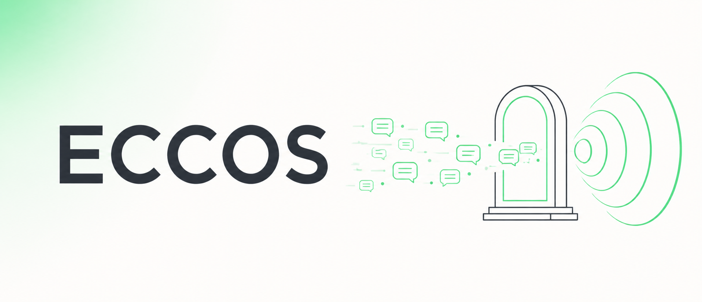

# Eccos — Brand & Style Guide

The visual identity for Eccos. Use this when creating any asset (banners, social cards,
favicons, slides, diagrams) so everything stays consistent.

The concept: **Eccos ≈ echoes.** Eccos is a *gateway* that relays WhatsApp messages between
Meta and your app. The identity leans on two motifs — **echo ripples** (sound waves, a nod to
the name) and a **gateway/portal** that messages flow through — over a clean, light surface with
a single WhatsApp-green glow.



---

## Logo / wordmark

- Wordmark is the word **ECCOS**, set in a bold geometric sans-serif (see Typography).
- **In imagery**: uppercase `ECCOS`. **In prose**: title-case `Eccos`.
- Give the wordmark generous clear space (≥ the cap-height on every side). Never crowd it.
- The standalone symbol is the **echo-ripple mark** — a source dot with concentric arcs
  radiating outward (`assets/logo.svg`). Use it for favicons/avatars and anywhere the full
  wordmark is too small to read.
- Don't: stretch, rotate, add drop shadows/outlines/gradients to the letters, or recolor the
  wordmark to anything outside Ink / White / Eccos Green.

## Color palette

Intentionally aligned with the **WhatsApp green family** — Eccos runs on the official WhatsApp
Cloud API, so the green signals "official," while the echo/gateway motif keeps it distinct. One
accent only (green); everything else is neutral.

| Token | Hex | Use |
|---|---|---|
| **Eccos Green** (primary) | `#25D366` | Primary accent: echo ripples, highlights, links/CTAs, the `PRs welcome` badge |
| **Deep Teal** (secondary) | `#128C7E` | Depth, secondary accents, gradient stops |
| **Dark Teal** | `#075E54` | Deepest accent, dark-surface tint |
| **Bubble Green** (soft) | `#DCF8C6` | Soft glows, highlight fills, message bubbles |
| **Ink** (text) | `#0B141A` | Wordmark on light surfaces, primary body text |
| **Slate** (muted) | `#667781` | Secondary text, captions, borders |
| **Paper** (light bg) | `#F7F9F8` | Default light background / surface |
| **White** | `#FFFFFF` | Surfaces, wordmark on dark/green |

**Glow gradient** (the banner's signature): a soft radial gradient of **Eccos Green** at
~10–15 % opacity fading to transparent, anchored in one corner over **Paper**.

**Surfaces**: prefer the **light** treatment (Ink wordmark on Paper + green glow, as in the
banner). A **dark** variant is allowed (White wordmark on Ink, green echo ripples) for hero
images that need more drama — keep the same green accent.

## Typography

Use **open-source (SIL OFL)** fonts only — this is an OSS project, assets should be
reproducible by anyone.

- **Display / wordmark** — a geometric sans: **Poppins** or **Montserrat** (SemiBold/Bold).
  Slightly tight letter-spacing for the wordmark.
- **Body / UI** — **Inter** (Regular/Medium).
- **Code / mono** — **JetBrains Mono**, or the system `ui-monospace` stack.

## Motifs & iconography

- **Echo ripples** *(signature)* — concentric ring arcs radiating outward, like sound echoes.
  The core brand shape; basis for the favicon/avatar.
- **Gateway / portal** — an arch/doorway form: the "gateway" messages pass through.
- **Message bubbles** — small rounded chat bubbles, ideally shown **flowing in one direction**
  (left→right) to read as a relay.
- **Network nodes** — faint dots/thin connectors, used sparingly, to hint "infrastructure."
- **Line-art** — consistent thin stroke, rounded caps and joins. Flat, no fills unless it's the
  green accent.

## Principles — do / don't

**Do**
- Flat vector, minimal, lots of negative space.
- One accent color (green); keep everything else neutral.
- High contrast; legible at small sizes.
- Light surface with a single soft green glow (or the dark variant).
- Put only the **wordmark** inside generated imagery — short and correctly spelled.

**Don't**
- No photos, people, 3D renders, or stock imagery.
- No multiple competing colors, rainbow gradients, drop shadows, or skeuomorphism.
- No baked-in body text / taglines inside images (generators garble them) — add real text as
  HTML/markdown next to the image.
- No gibberish lettering; if a generator can't spell `ECCOS`, regenerate.

## Layout & formats

- **Hero banner** — ratio ≈ **21:9** (source `2560×1104`). Wordmark left-of-center, motif on the
  right, generous whitespace. Ship an optimized display copy ≤ `1440px` wide.
- **Favicon / avatar** — `1:1`, the echo-ripple mark on White or Eccos Green.
- **In READMEs** — center with `<div align="center">`, always set descriptive `alt` text.

## Asset generation recipe

The banner was generated with **MeiGen → `gpt-image-2`**, then downscaled. To make matching
assets, reuse this recipe and just swap the subject line.

**Settings:** `aspectRatio: "21:9"`, `resolution: "2K"`.

**Prompt template:**

> Wide minimalist hero banner for an open-source developer tool, GitHub README header. Soft
> off-white / `Paper` background with a gentle WhatsApp-green (`#25D366`) gradient glow in one
> corner. Bold modern geometric sans-serif wordmark **"ECCOS"** in dark charcoal, perfectly
> spelled, large, left of center. To the right, **‹swap motif here›** — e.g. a clean line-art
> *gateway/portal* channeling a stream of rounded message chat bubbles flowing left→right,
> combined with concentric **echo ripple rings** in WhatsApp green. Flat vector illustration,
> elegant, generous whitespace, professional, one accent color. No people, no photo, no extra
> text besides the word ECCOS, no gibberish, correct spelling.

**Post-process** (downscale + keep the repo lean):

```bash
sips -Z 1440 source.png --out docs/assets/banner.png
```

> Rule of thumb: keep correctly-spelled text in-image to the **wordmark only**. Everything
> else (taglines, badges, body copy) is real text placed next to the image.

## Asset inventory

| Asset | Path | Use |
|---|---|---|
| **Logomark** (symbol) | `assets/logo.svg` | The echo-ripple mark, green on transparent — README/docs, light or dark |
| **App icon** | `assets/icon.svg` | Green squircle + white mark; source for avatar & favicon |
| **Favicon** | `assets/favicon.svg` · `assets/favicon-32.png` · `assets/favicon-16.png` | Browser tab / site icon (SVG + PNG fallbacks) |
| **Avatar** | `assets/avatar.png` | 512×512 — GitHub / social profile image |
| **Hero banner** | `assets/banner.png` | README header, 1440×621 |

The icon set is hand-authored **SVG** (exact brand hex, infinitely scalable). PNGs are rasterized
from the SVGs — regenerate with:

```bash
qlmanage -t -s 512 -o . icon.svg && sips -Z 512 icon.svg.png --out avatar.png   # macOS
```

_Full-resolution banner sources are kept outside the repo; regenerate from the recipe above._
