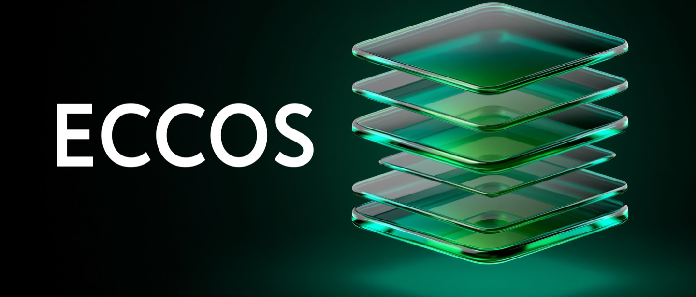

# Eccos — Brand & Style Guide

The visual identity for Eccos. Use this when creating any asset (banners, social cards,
favicons, slides) so everything stays consistent.

The concept: Eccos is a *gateway* that relays WhatsApp messages between Meta and your app. The
identity is **premium glassmorphism** — translucent **stacked glass layers** (the relay / echo
passing through, *Eccos ≈ echoes*) in an emerald-green→teal iridescent gradient, glowing on a
deep dark surface. Dark-mode-first, modern, fancy.



---

## Logo / wordmark

- **Logomark**: a stack of **translucent glass layers/tiles** with depth and inner glow
  (`assets/avatar.png`). It reads as layered relay / echo and is the brand's hero shape.
- **Wordmark**: the word **ECCOS** in a bold geometric sans-serif, white, on the dark surface.
- **In imagery**: uppercase `ECCOS`. **In prose**: title-case `Eccos`.
- **Favicon** is a *simplified, flat* version of the stacked layers (`assets/favicon.svg`) so it
  stays legible at 16–32 px, where the full glass render turns to mush.
- Give the mark generous clear space. Don't stretch, rotate, or flatten it into a dated glossy
  "white glyph on a green squircle" app icon — keep the glass depth.

## Color palette

Built on the WhatsApp-green family (Eccos runs on the official WhatsApp Cloud API), pushed into
a vibrant **emerald→teal iridescent** range for the glass, on near-black surfaces.

| Token | Hex | Use |
|---|---|---|
| **Eccos Green** (primary) | `#25D366` | Brand anchor: accents, links/CTAs, the `PRs welcome` badge |
| **Glow Green** (bright) | `#34E27A` | Glass highlights, the brightest gradient stop |
| **Teal** (secondary) | `#0FB39A` | The cool end of the glass gradient |
| **Iridescence** | cyan/blue hints | Emergent refraction in the glass — don't force a fixed hex |
| **Charcoal** (surface) | `#0B141A` | Primary dark surface / background |
| **Slate-dark** (raised) | `#10171D` | Cards, the favicon squircle |
| **White** | `#FFFFFF` | Wordmark and text on dark |
| **Paper** | `#F7F9F8` | Rare light-context surface |

**Material — glass**: translucency, layered depth, soft inner glow, subtle reflections and a
green halo. Surfaces are **dark by default**; the glass and glow provide the color.

## Typography

Open-source (SIL OFL) fonts only — assets should be reproducible by anyone.

- **Display / wordmark** — geometric sans: **Poppins** or **Montserrat** (SemiBold/Bold), white.
- **Body / UI** — **Inter**.
- **Code / mono** — **JetBrains Mono**, or the system `ui-monospace` stack.

## Motif & principles

- **Stacked glass layers** *(logomark)* — translucent tiles stacked with depth = relay / echo.
  The core shape; the favicon is its flat, simplified form.
- **Glow** — a soft green halo behind the glass on the dark surface.

**Do**: lead with the glass-layers motif; keep depth, translucency and the green glow; dark
surfaces; one accent family (green→teal); the only in-image text is the wordmark `ECCOS`.

**Don't**: no flat "green squircle + white glyph" app-icon clichés; no photos of people; no
competing colors; don't bake taglines/body copy into images (add real text next to them); don't
use the detailed glass render at tiny sizes — use the flat favicon.

## Asset generation recipe

The banner and logomark were generated with **Midjourney V8.1** (via MeiGen), then cropped and
optimized. To make matching assets, reuse these prompts. *(Premium model — needs purchased
MeiGen credits.)*

**Logomark** — `model: midjourney-v8.1`, `aspectRatio: 1:1`, `resolution: 2K`:

> A premium app icon: an isometric stack of translucent rounded glass tiles and layers with
> depth, soft reflections and inner glow, in a vibrant emerald-green→teal iridescent gradient,
> on a deep charcoal background. Ultra-clean, minimal, premium, centered. No text, no letters.

**Banner** — `model: midjourney-v8.1`, `aspectRatio: 16:9`, `resolution: 2K`:

> Wide hero banner, dark-mode. Deep charcoal background with a soft emerald glow. On the left,
> a large geometric sans-serif wordmark "ECCOS" in crisp white, perfectly spelled. On the
> right, glassmorphism: translucent stacked rounded glass tiles with depth, reflections and
> inner glow, emerald-green→teal iridescent gradient. Ultra-clean, premium, generous negative
> space. No extra text besides ECCOS.

**Post-process** (macOS, no extra tooling):

```bash
sips -c 1262 2944 banner.png --out crop.png   # 16:9 → 21:9 hero, centered
sips -Z 1440 crop.png --out banner-1440.png
sips -s format jpeg -s formatOptions 82 banner-1440.png --out banner.jpg   # photographic → JPG
sips -c 1500 1500 logo.png --out icon.png      # drop baked text, square
```

> Keep correctly-spelled in-image text to the wordmark only; everything else (taglines, badges)
> is real text placed next to the image. For the favicon, hand-author the flat layers in SVG.

## Asset inventory

| Asset | Path | Use |
|---|---|---|
| **Hero banner** | `assets/banner.jpg` | README header, 1440×617 (21:9), dark glass |
| **Logomark / avatar** | `assets/avatar.png` | 512×512 glass stacked-layers — logo & GitHub/social avatar |
| **Favicon** | `assets/favicon.svg` · `assets/favicon-32.png` · `assets/favicon-16.png` | Flat simplified layers (legible small) |

_Full-resolution sources are kept outside the repo; regenerate from the recipe above when needed._
